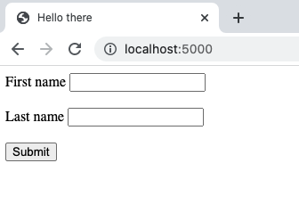
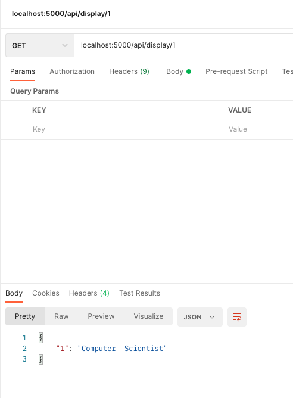
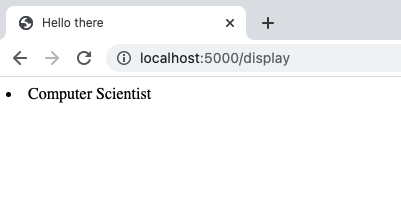
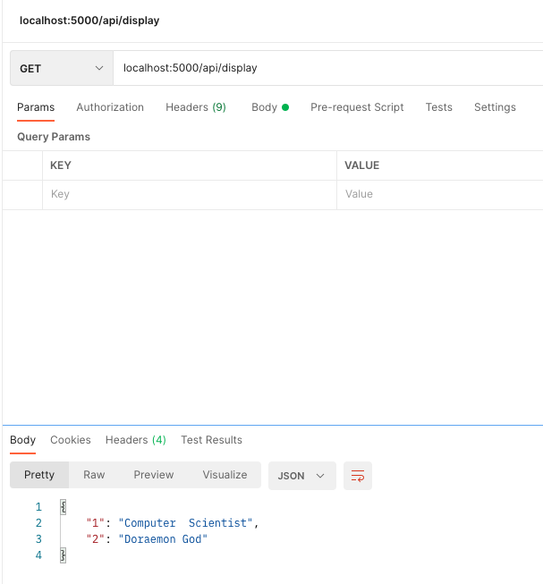
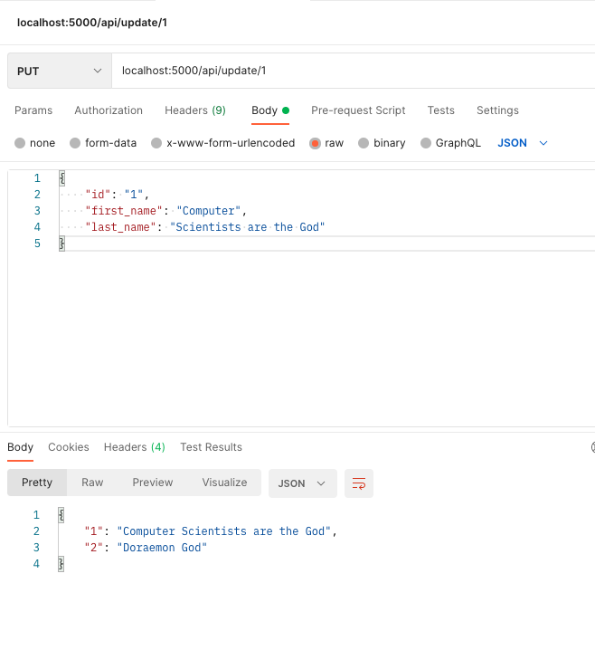
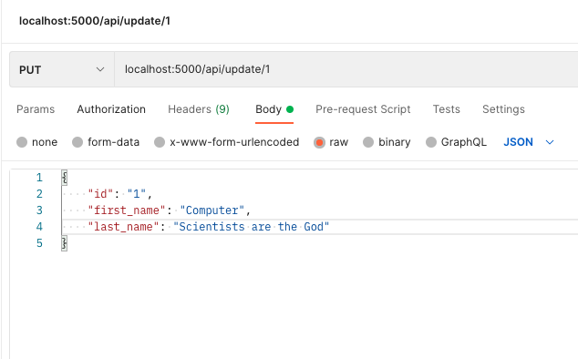
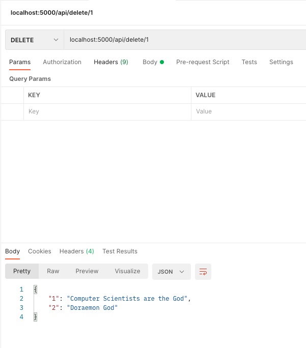
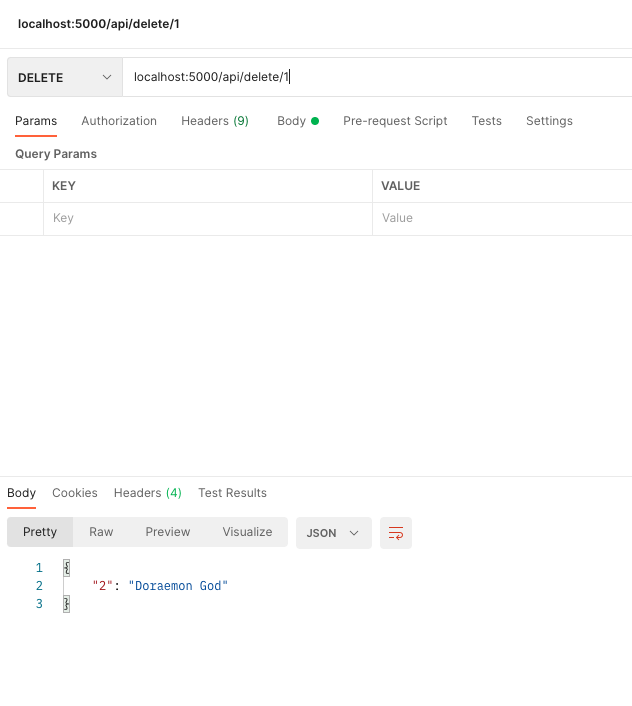

#  All Assignments completed for Web3

| # | Assignment | Due-Date | Completed |
|:---------:|-----------:|:---------:|:------------:|
| 1)| [Basic API with Node](https://github.com/RupeshPanta/Web3_Node_Basic_Api)  | NA | :white_check_mark: |
| 2) | [Basic API with Flask](https://github.com/RupeshPanta/Web3_Basic_API) | NA | :white_check_mark: |
| 3) | [Final](https://github.com/RupeshPanta/Web3-Final)  | NA| :white_check_mark: |


# Flask Example is on this repo :


# Goal
This is a simple Rest API that has CRUD functionality. I created this using python, flask, HTML and SQLite portable database resource.  
 

# Simple REST API
- Flask rest api (CRUD)
    - [x] Post ---> Create
    - [x] Get  ---> REAd
    - [x] Put ----> Update
    - [x] Delete --> Delete
- Real time modification with api
- Postman for API (Download postman)

# Run flask app
```bash
Go to app.py file
open terminal
type export FLASK_APP=app
type export FLASK_ENV=development
type flask run
server should run on localhost/5000 by default
open postman and send api request
```

# ScreenShots: 
<br/> <br/> 
---
<br/> <br/> 
<br/> <br/> 
<br/> <br/> 
<br/> <br/> 
<br/> <br/> 
<br/> <br/>

